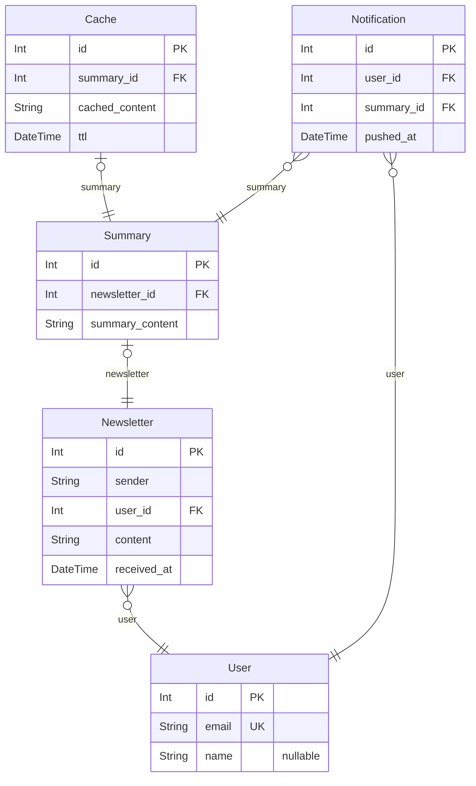

# PROJECT
> Generated by [`prisma-markdown`](https://github.com/samchon/prisma-markdown)

- [default](#default)

## default

### `User`

**Properties**
  - `id`: Primary Key
  - `email`: 유저 이메일로 중복되지 않는 unique 값
  - `name`: 유저 이름 (optional)

### `Newsletter`

**Properties**
  - `id`: Primary Key
  - `sender`: 뉴스레터 발신자 정보
  - `user_id`: Foreign Key, 뉴스레터를 수신하는 유저 식별자
  - `content`: 뉴스레터 본문
  - `received_at`: 뉴스레터 수신 날짜

### `Summary`

**Properties**
  - `id`: Primary Key
  - `newsletter_id`: Foreign Key, 요약한 뉴스레터 식별자
  - `summary_content`: 뉴스레터 요약본 내용

### `Cache`

**Properties**
  - `id`: Primary Key
  - `summary_id`: Foreign Key, 캐싱된 요약본 식별자
  - `cached_content`: 요약본 내용 (빠른 접근 목적)
  - `ttl`: 캐싱 만료 날짜

### `Notification`

**Properties**
  - `id`: Primary Key
  - `user_id`: Foreign Key, 푸시 알림을 수신하는 유저 식별자
  - `summary_id`: Foreign Key, 캐싱된 요약본 식별자
  - `pushed_at`: 푸시 알림이 발송된 날짜