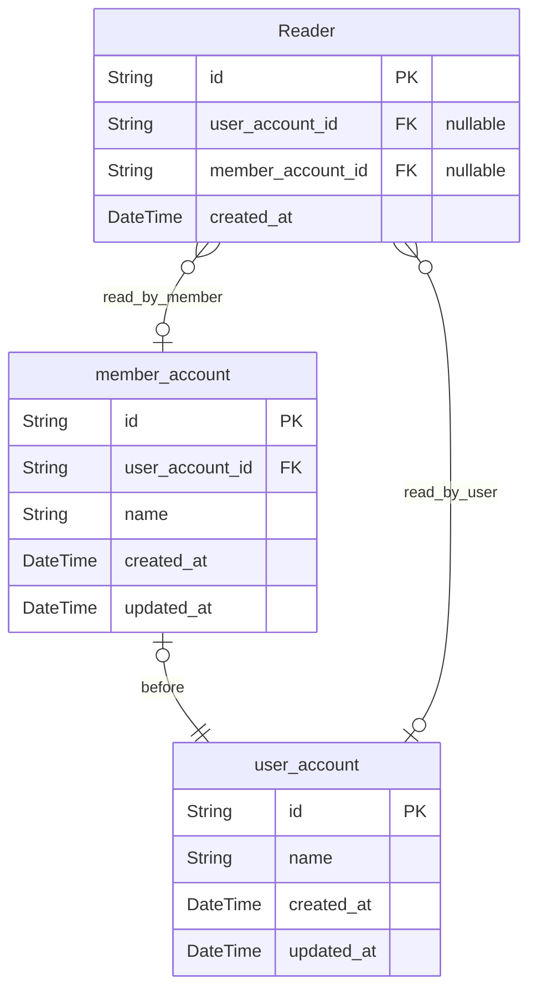

# Mailly
> Generated by [`prisma-markdown`](https://github.com/samchon/prisma-markdown)

- [Users](#users)

## Users

### `user_account`
User Account

Mailly의 비회원 유저 계정을 관리합니다.

**Properties**
  - `id`: Primary Key.
  - `name`: User name
  - `created_at`: Creation time of record.
  - `updated_at`: Update time of record.

### `member_account`
Member Account

Mailly의 회원 유저 계정을 관리합니다.

**Properties**
  - `id`: Primary Key.
  - `user_account_id`: 
  - `name`: Member name
  - `created_at`: Creation time of record.
  - `updated_at`: Update time of record.

### `Reader`
Reader

Mailly 사용자의 Read Actor 입니다.
Reader는 "읽기"활동을 실제로 진행하는 Entity로, 회원/비회원 사용자에게서 생성될 수 있습니다.

Mailly 베타 버전에서 Reader의 의미는 "읽었다"라는 의미로 Feed를 읽을 때 생성됩니다.

비회원인 상태에서 글을 읽었던 사용자가 회원으로 전환했을 경우 회원 계정의 정보를 연결하여,
계정 전환 이전의 읽기 기록을 유지할 수 있도록 돕습니다.

**Properties**
  - `id`: Primary Key.
  - `user_account_id`
    > User Account
    > 
    > 글을 읽은 User(비회원)에 대한 정보를 연결합니다.
  - `member_account_id`
    > Member Account
    > 
    > 글을 읽은 Member(회원)에 대한 정보를 연결합니다.
  - `created_at`: Creation time of record.