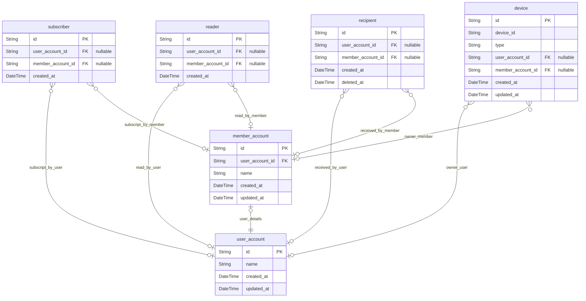
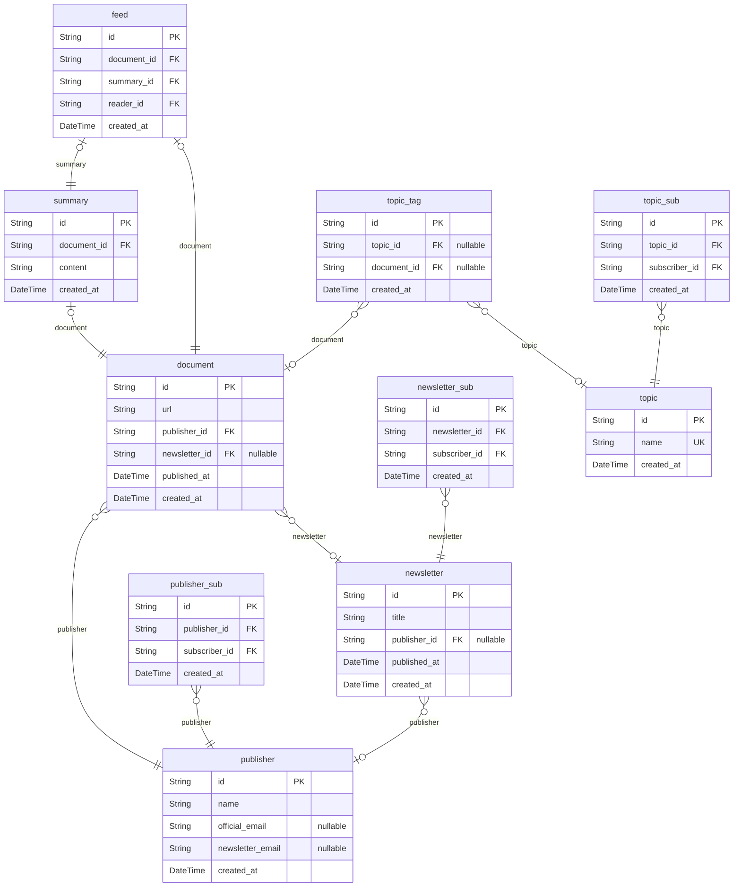
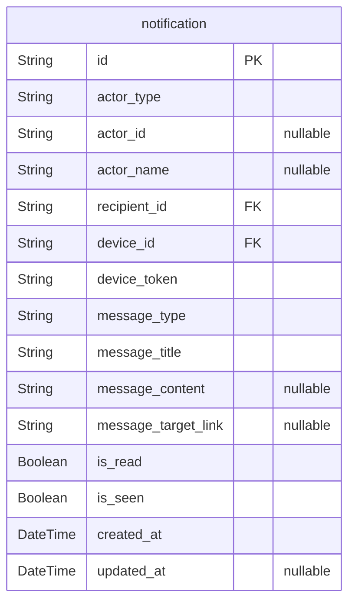

# Mailly
> Generated by [`prisma-markdown`](https://github.com/samchon/prisma-markdown)

- [Account](#account)
- [Document](#document)
- [Notification](#notification)

## Account

### `user_account`
User Account

Mailly의 비회원 유저 계정을 관리합니다.

**Properties**
  - `id`: Primary Key.
  - `name`: User name
  - `created_at`: Creation time of record.
  - `updated_at`: Update time of record.

### `member_account`
Member Account

Mailly의 회원 유저 계정을 관리합니다.

**Properties**
  - `id`: Primary Key.
  - `user_account_id`: 
  - `name`: Member name
  - `created_at`: Creation time of record.
  - `updated_at`: Update time of record.

### `subscriber`
Subscriber

Mailly 사용자의 Subscript Actor 입니다.
구독과 관련된 모든 행위를 정의 합니다.

구독 행위:
- 관심 분야 선택
- 뉴스레터 구독
- 발행자 구독 등

**Properties**
  - `id`: Primary Key.
  - `user_account_id`
    > User Account
    > 
    > 구독을 진행한 User(비회원)에 대한 정보를 연결합니다.
  - `member_account_id`
    > Member Account
    > 
    > 구독을 진행한 Member(회원)에 대한 정보를 연결합니다.
  - `created_at`: Creation time of record.

### `reader`
Reader

Mailly 사용자의 Read Actor 입니다.
Reader는 "읽기"활동을 실제로 진행하는 Entity로, 회원/비회원 사용자에게서 생성될 수 있습니다.

Mailly 베타 버전에서 Reader의 의미는 "읽었다"라는 의미로 Feed를 읽을 때 생성됩니다.

비회원인 상태에서 글을 읽었던 사용자가 회원으로 전환했을 경우 회원 계정의 정보를 연결하여,
계정 전환 이전의 읽기 기록을 유지할 수 있도록 돕습니다.

**Properties**
  - `id`: Primary Key.
  - `user_account_id`
    > User Account
    > 
    > 글을 읽은 User(비회원)에 대한 정보를 연결합니다.
  - `member_account_id`
    > Member Account
    > 
    > 글을 읽은 Member(회원)에 대한 정보를 연결합니다.
  - `created_at`: Creation time of record.

### `recipient`
Recipient

Mailly 사용자의 Recipient Actor 입니다.
Recipient는 "알림 수신"활동을 실제로 진행하는 Entity로, 회원/비회원 사용자에게서 생성될 수 있습니다.

Mailly 베타 버전에서 Recipient의 의미는 "알림을 수신하였다"라는 의미로 Notification를 읽을 때 생성됩니다.

비회원인 상태에서 글을 읽었던 사용자가 회원으로 전환했을 경우 회원 계정의 정보를 연결하여,
계정 전환 이전의 수신 받았던 알림 기록을 유지할 수 있도록 돕습니다.

**Properties**
  - `id`: Primary Key.
  - `user_account_id`
    > User Account
    > 
    > 알림을 수신한 User(비회원)에 대한 정보를 연결합니다.
  - `member_account_id`
    > Member Account
    > 
    > 알림을 수신한 Member(회원)에 대한 정보를 연결합니다.
  - `created_at`: Creation time of record.
  - `deleted_at`: Deletion time for record.

### `device`
Device

Mailly 사용자의 로그인 기기를 저장하는 저장소입니다.
iOS/Android device ID를 저장합니다.

User는 Device와 1:1로 연결되며, Member는 Device와 1:n으로 연결됩니다.
비회원으로 사용하던 유저가 회원으로 변경한다면 Device에 대한 정보에 Member account가 추가됩니다.

활성화된 기기에 대한 정보는 캐시에 저장되어 다중 접속을 차단합니다.

**Properties**
  - `id`: Primary Key.
  - `device_id`
    > device ID
    > 
    > iOS/Android device ID를 저장합니다.
  - `type`: 기기의 유형 (android, ios, web 등)
  - `user_account_id`: 
  - `member_account_id`: 
  - `created_at`: Creation time of record.
  - `updated_at`: Update time of record.

## Document

### `document`
Document Entity

**Properties**
  - `id`: Primary Key.
  - `url`: 원본 글 url
  - `publisher_id`: 발행자 정보
  - `newsletter_id`
    > 뉴스레터 정보
    > 
    > 관련된 뉴스레터가 없을 수 있습니다.
  - `published_at`
    > Publish Time
    > 
    > 실제로 해당 뉴스레터가 발행된 "일자"를 저장합니다.
    > "일자"의 기준은 가장 처음 해당 뉴스레터가 발견되었을 때를 기준으로 합니다.
  - `created_at`: Creation time of record

### `summary`
Summary Entity

**Properties**
  - `id`: Primary Key.
  - `document_id`: 본문 문서 정보
  - `content`: 요약된 Text를 저장합니다.
  - `created_at`: Creation time of record

### `feed`
Feed Entity

**Properties**
  - `id`: Primary Key.
  - `document_id`: 본문 문서 정보
  - `summary_id`: 요약 문서 정보
  - `reader_id`: 독자 정보
  - `created_at`: Creation time of record

### `publisher`
publisher Entity

원본 글, 뉴스레터 등을 발행한 문서 발행자 정보를 담습니다.
문서의 발행자는 글의 작성자와는 다르며 기업, 단체, 개인 등이 발행자로 등록될 수 있습니다.

**Properties**
  - `id`: Primary Key.
  - `name`: publisher name
  - `official_email`
    > Official Email
    > 
    > 발행자의 메인 이메일을 말합니다.
    > 기업의 경우 기업 공식 이메일을 지칭하며, 
    > 개인의 경우 공개된 비지니스 이메일을 저장합니다.
  - `newsletter_email`
    > NewsLetter Email
    > 
    > 발행자의 NewsLetter 발행용 Email을 저장합니다.
  - `created_at`: Creation time of record

### `publisher_sub`
Publisher Subscript

사용자의 관심 발행자 구독 내역을 관리합니다.

**Properties**
  - `id`: Primary Key.
  - `publisher_id`: 
  - `subscriber_id`: 
  - `created_at`: Creation time of record

### `newsletter`
NewsLetter

**Properties**
  - `id`: Primary Key.
  - `title`: News Letter Title
  - `publisher_id`: publisher
  - `published_at`
    > Publish Time
    > 
    > 실제로 해당 뉴스레터가 발행된 "일자"를 저장합니다.
    > "일자"의 기준은 가장 처음 해당 뉴스레터가 발견되었을 때를 기준으로 합니다.
  - `created_at`: Creation time of record

### `newsletter_sub`
Newsletter Subscript

사용자의 뉴스레터 구독 내역을 관리합니다.

**Properties**
  - `id`: Primary Key.
  - `newsletter_id`: 
  - `subscriber_id`: 
  - `created_at`: Creation time of record

### `topic`
Topic

문서 분류에 사용될 Topic입니다.

**Properties**
  - `id`: Primary Key.
  - `name`: Topic name
  - `created_at`: Creation time of record

### `topic_tag`
Topic Tag

문서 분류에 사용될 Topic을 문서에 연결합니다.

**Properties**
  - `id`: Primary Key.
  - `topic_id`: 
  - `document_id`: 
  - `created_at`: Creation time of record

### `topic_sub`
Topic Subscript

사용자의 관심 분야 구독 내역을 관리합니다.

**Properties**
  - `id`: Primary Key.
  - `topic_id`: 
  - `subscriber_id`: 
  - `created_at`: Creation time of record

## Notification

### `notification`
Notification Entity

**Properties**
  - `id`: Primary Key.
  - `actor_type`
    > actor type
    > 
    > 알림을 발생 시킨 주체의 유형
    > (ex. system, publisher, newsletter)
  - `actor_id`
    > actor id
    > 
    > 알림을 발생 시킨 주체의 ID
    > (ex. 특정 Actor ID)
  - `actor_name`
    > actor name
    > 
    > 알림을 발생시킨 주체의 이름
  - `recipient_id`: recipient id
  - `device_id`: device id
  - `device_token`: FCM device token
  - `message_type`
    > message type
    > 
    > 알림의 유형 정보를 설정합니다.
    > (ex. feed_update, summary_ready, system_alert)
  - `message_title`
    > message title
    > 
    > message의 title을 작성합니다.
  - `message_content`
    > message content
    > 
    > message를 선택하면 나오는 알림 상새 내용
  - `message_target_link`
    > message deeplink
    > 
    > message를 선택하면 이동할 링크
  - `is_read`
    > 사용자가 읽었는지 여부
    > 
    > 읽었다의 기준: notification을 클릭했다는 것
  - `is_seen`: 사용자가 화면에서 봤는지 여부
  - `created_at`: Creation time of record.
  - `updated_at`: Update time of record.