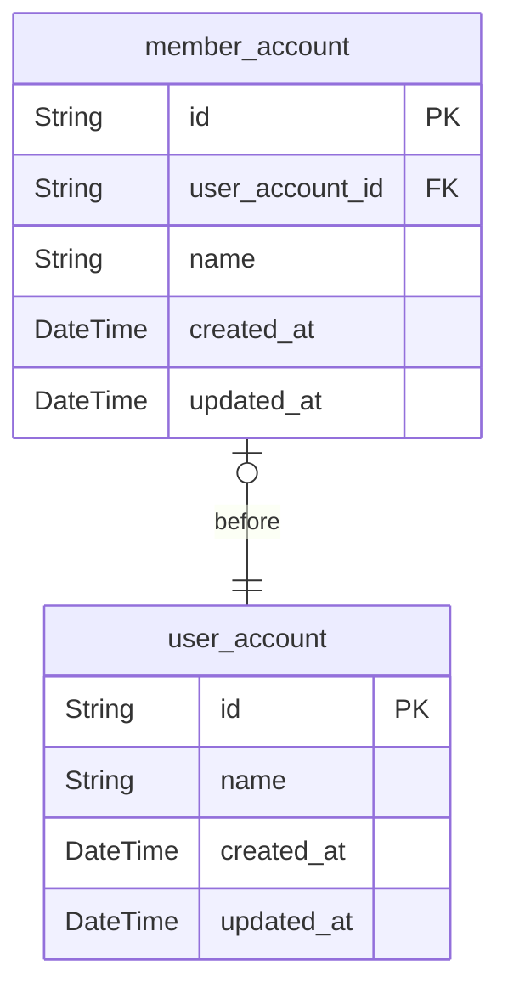

# Mailly
> Generated by [`prisma-markdown`](https://github.com/samchon/prisma-markdown)

- [Users](#users)

## Users

### `user_account`
User Account

Mailly의 비회원 유저 계정을 관리합니다.

**Properties**
  - `id`: Primary Key.
  - `name`: User name
  - `created_at`: Creation time of record.
  - `updated_at`: Update time of record.

### `member_account`
Member Account

Mailly의 회원 유저 계정을 관리합니다.

**Properties**
  - `id`: Primary Key.
  - `user_account_id`: 
  - `name`: Member name
  - `created_at`: Creation time of record.
  - `updated_at`: Update time of record.